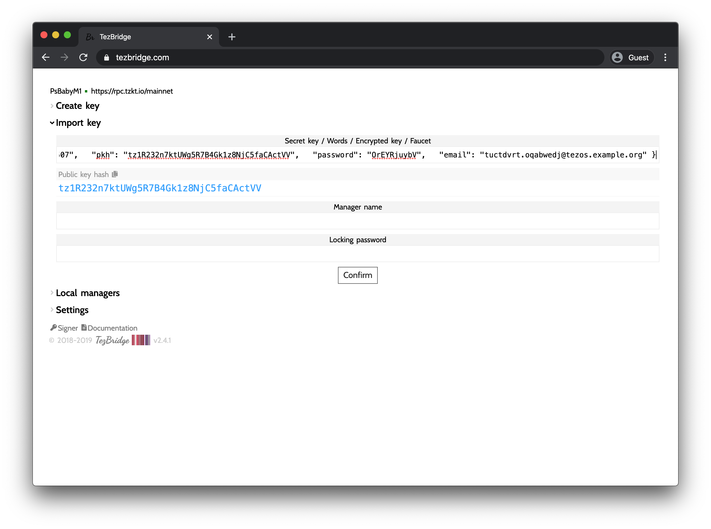

# Add accounts to Tezbridge

This document describes how to add an account to the Tezbridge account.

## Get accounts data

The site [faucet.tzalpha.net](https://faucet.tzalpha.net/) enables to generate and download a new account data.

3 accounts data are alerady generated for you to interact with the contract:
- [Learner](./learner1.json)
- [Institution](./institutiton1.json)
- [Certifier](./certifier1.json)

## Add an account to Tezbridge

Copy paste the content of the json account file in the 'Import Key' field

Name this account (for example "Learner1") in the 'Manager name' field and prvode a password in the 'Locking password field'.

Finally click the 'Confirm' bouton.