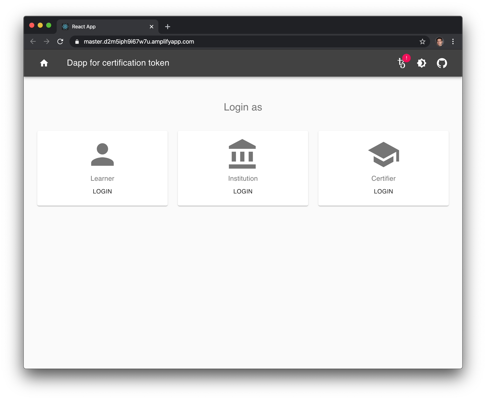
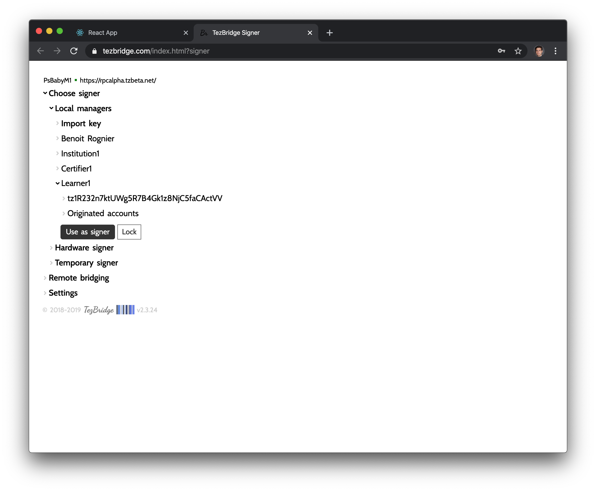
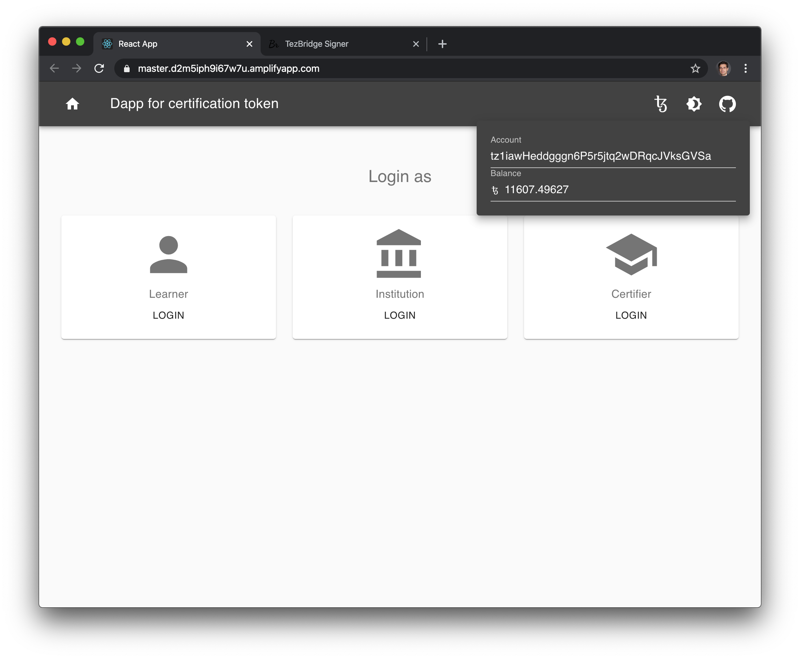
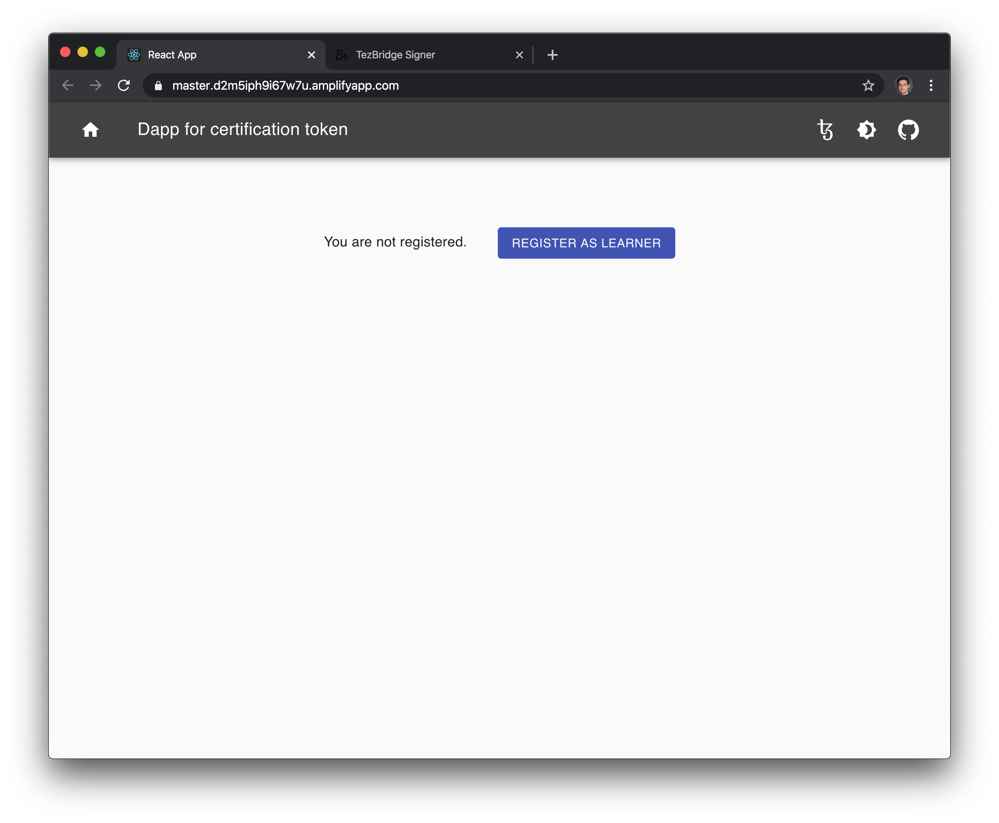
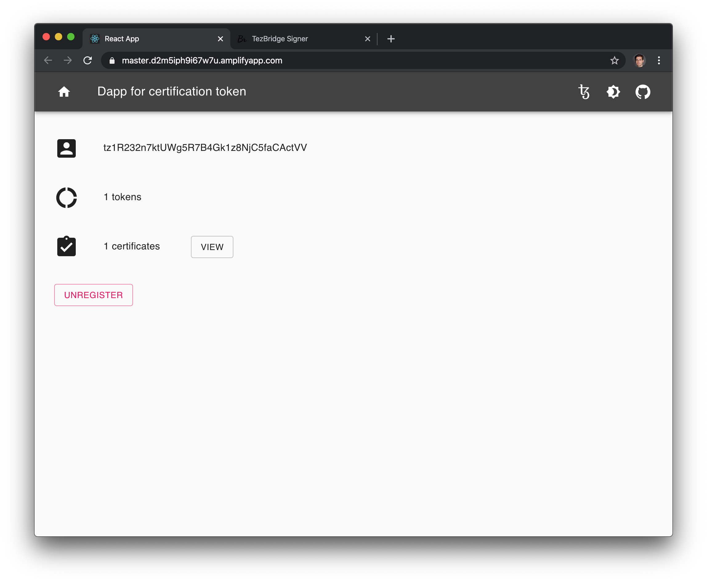
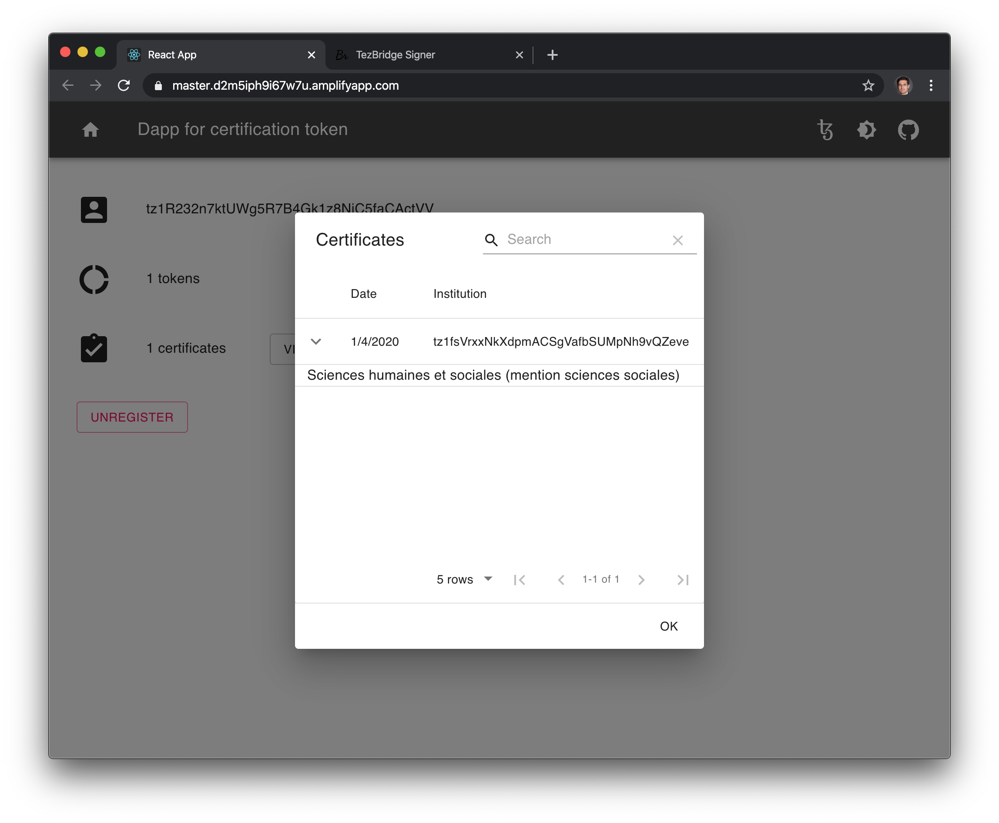
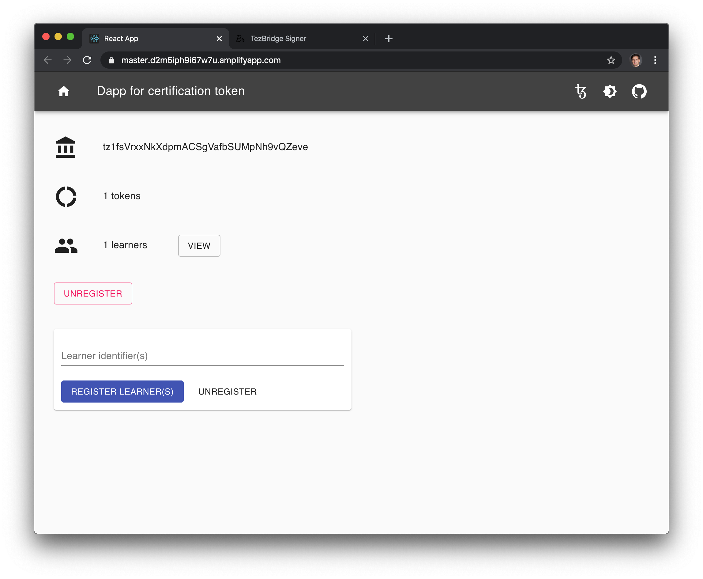
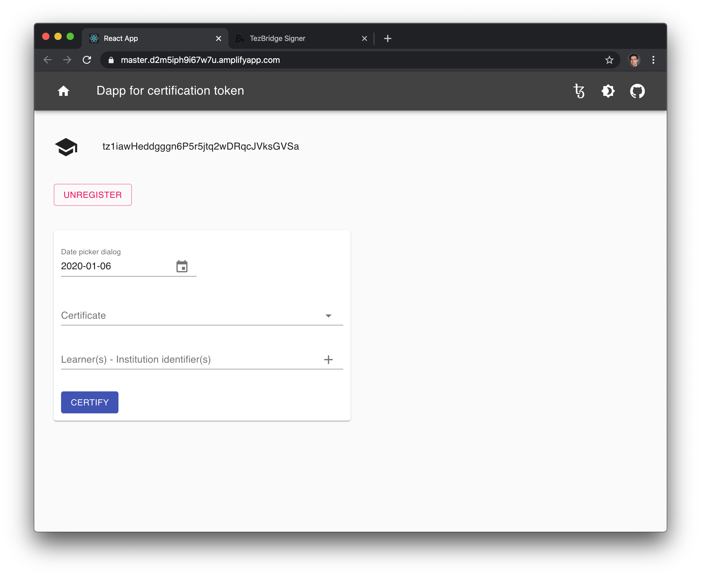
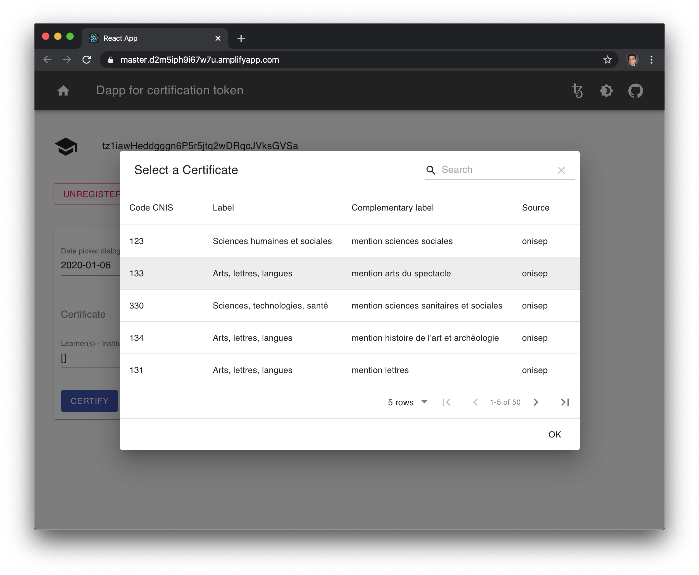
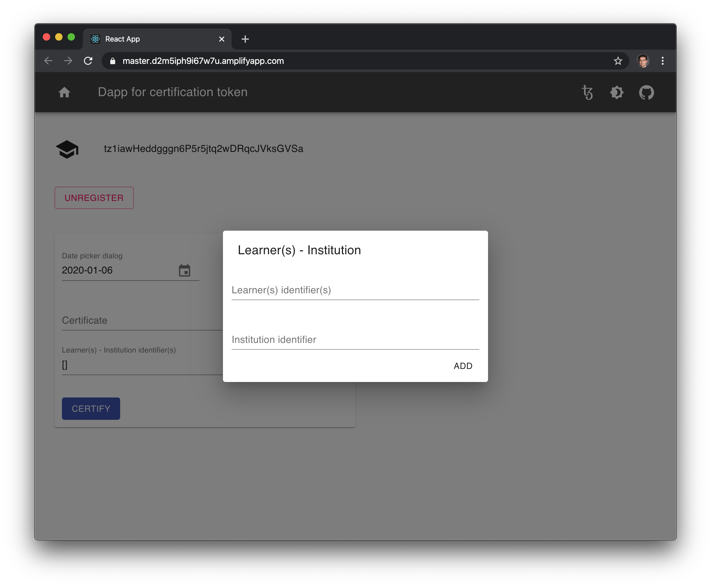

# Certification Token Dapp

## Landing

The landing page invites to login as a a learner, an institution or a certifier.

The Tezos wallet warning tag ('!') in the upper right corner indicates that you need to sign in as a user. Click on it to open Tezbridge wallet.

##  TezBridge wallet.

Select a profile.

## Wallet info

Once logged in, the Tezos id and the balance is displayed. Click on one of the profile.

## Register

Register if not regsitered yet.

## Learner

Learner panel displays the number of tokens and the list of certifications.

Click on view to view the certifications.

## Institution

Insitution panel displays the number of tokens and the list of learners associated.

It is possilbe to associtate learners to this institution.

## Certifier

Certifier panel allows to certify viewers.

Select a certificate (here from the Onisep database).

Declare a list of learner ids and an institution id.

